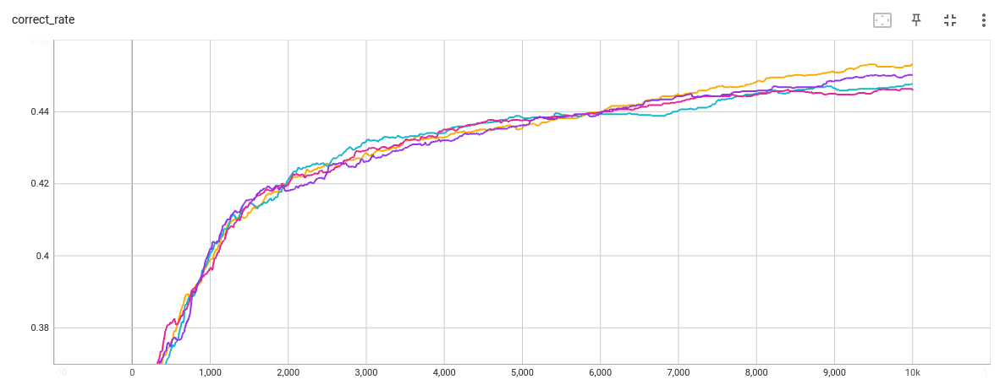
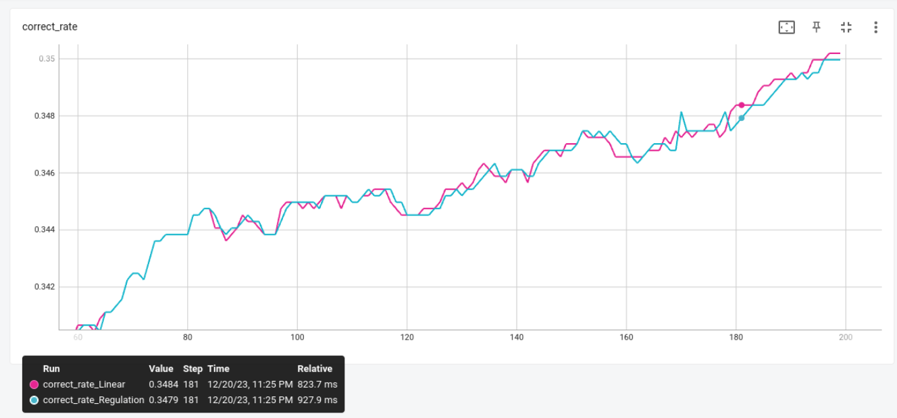
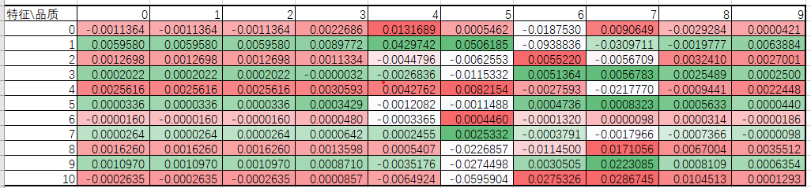
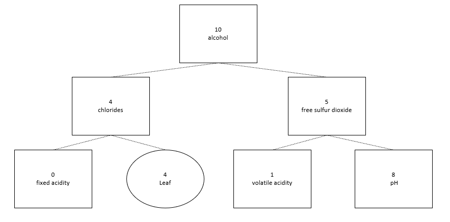
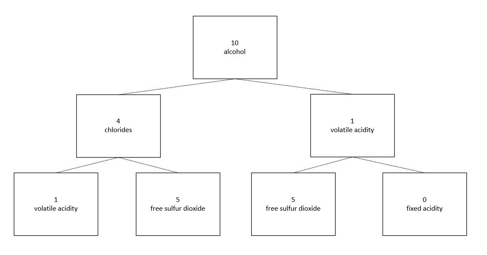

# 机器学习第二次作业
董浩宇 502023150001

##  1. 实现方案
### 1.1 DataLoader
为了更加方便的实现训练数据的读取，分割以及特征缩放，在本次作业中设计了dataLoader类，使用此类对数据集进行处理。

本次作业中使用到了所有算法都使用DataLoader类来载入、分割、缩放数据。本次作业默认使用标准化特征缩放，十折分割验证。

### 1.2 softmax回归
softmax多元回归模型公式可以表示为：
$$P(y=k|x;\theta) = \frac{e^{\theta^T_kx}}{\sum^K_{j=1}e^{\theta^T_jx}}=\sigma_k(x,\theta),k=1,2,...,K$$
预测分类$\hat{y^*}$为:

$$ \mathop{\arg\max}\limits_{k}p_k(y|x^*,\hat{\theta}),k=1,2,..,K $$


也就是说，假设现在的数据集中标签种类数为K，即创建K个线性回归模型，将数据集特征输入线性回归模型，得到K个结果，那个标签的结果大，就认为当前特征对应此标签。softmax的作用是扩大K个线性回归模型输出结果的差距。

在代码实现中：数据集共有11个特征，加上一个偏置项，线性回归的输入共有12维。因为酒分为0~9十个等级，故需要建立10个线性回归模型，这里为了方便运算，我直接创建了一个12输入，10输出的线性回归模型：
$$\hat{y} = x \theta $$
N为训练集中data数量，其中$\hat{y}$为N*10维向量，表示特征属于各个标签的预测概率，$\theta$为12\*10维矩阵，x为N\*12维向量，表示数据集里的特征。使用这样的写法，只需要一次矩阵运算，就可以通过线性回归直接算出来训练集中所有data对于十个标签的概率。

对于模型的训练，使用梯度下降法，梯度的计算方法为：
$$\frac{\partial J(\theta)}{\partial\theta_l}=-\sum^N_{i=1}[x_i 1\{y_i=l\}-\sigma_l(x_i,\theta)]$$

如果直接使用上面的公式，需要用到循环，然而python的循环很慢，使用循环的话是不现实的。为了解决这个问题，我这里使用了one-hot编码，编码方式为：

|   特征\品质   | 0  | 1  |2|3|4|5|6|7|8|9|
|  ----   | ----  | ----  |---- |---- |---- |---- |---- |---- |---- |---- |
| x0  | 1 | 0 | 0|0 |0 |0 |0 |0 |0 |0 |0 |0 |
| x1  | 0 | 1 |0 |0 |0 |0 |0 |0 |0 |0 |0 |
| x2  | 0 | 0 | 1|0 |0 |0 |0 |0 |0 |0 |0 |
| x3  | 0 | 0 |0|1 |0 |0 |0 |0 |0 |0 |0 |
| x4  | 0 | 0 |0 |0 |1 |0 |0 |0 |0 |0 |0 |
| x5  | 0 | 0 | 0|0 |0 |1 |0 |0 |0 |0 |0 |
| x6  | 0 | 0 |0|0 |0 |0 |1 |0 |0 |0 |0 |
| x7  | 0 | 0 |0 |0 |0 |0 |0 |1 |0 |0 |0 |
| x8  | 0 |0 | 0|0 |0 |0 |0 |0 |1 |0 |0 |
| x9  | 0 | 0 |0|0 |0 |0 |0 |0 |0 |1 |0 |0 |

这样的话data的标签y也是一个10维的向量，也就是说，可以直接通过$\hat{y}-y$来一下子计算出十个模型的loss，也可以通过
$$\frac{\partial J(\theta)}{\partial\theta}=X^T(X\theta-Y)$$
的公式直接计算出十个回归模型的梯度。（上面式子中，Y为N*10的矩阵，$X\theta$也就是$\hat{y}$，也是N*10的矩阵。）

使用这样的方法实现的代码速度巨快无比，10000次梯度下降只需要几秒钟，而且只需要在上一次作业的基础上改一下参数矩阵就可以了。

### 1.3 决策树
#### 1.3.1 决策树的实现
在python中使用嵌套列表的方式去实现树形结构。在作业的代码中，使用一个node class来表示树中的节点,每一个节点可以指向另外两个节点，从而生成二叉决策树。在node中保存一些信息，用来表示此节点的类型（leaf root inner），保存此节点决策使用的特征以及特征的划分方式。

```
class node():
        def __init__(self,inputs...):
            infomations...

            l_n = None(代表子节点1)
            r_n = None(代表子节点2)
            self.next = [l_n,r_n]
```
因为node可以指向其他node，可以使用递归的方式进行生成以及遍历。
遍历生成的伪代码如下：
```
def generate_tree(inputs)  
        
        if 停止递归：
            将此node设置为leaf型
            return

        L_node = node(分给子节点的数据以及特征,inner型)
        now_node.子节点1 = generate_tree(L_node)
    
        R_node = node(分给子节点的数据以及特征,inner型)
        now_node.子节点2 = generate_tree(R_node)

        return now_node
        
```
使用这样的递归方法，只需要按照PPT上的停止递归条件，以及数据分割条件，就可以很方便地生成各种各样的二叉决策树。

决策树的遍历很简单，只需要按照不同节点的条件进行递归即可，直到递归到leaf节点为止。

#### 1.3.2 C4.5决策树
**特征分割**

由于在本次作业的任务中，所有的特征都是连续特征，故对于每个特征，都需要找到能够使其分割的信息增益比最大的分割点。这里采用的分割方式为：给定样本集D和连续特征a，假定a在D上出现了n个不同的取值，将这些值从小到大排列$\{a^1,a^2,...,a^n\}$,基于划分点$t$ 可将 $D$ 分为子集$D^-_t$和$D^+_t$，其中$D^-_t$包含哪些包含在属性a上取值不大于$t$的样本，$D^+_t$包含哪些包含在属性a上取值大于$t$的样本，因此对于连续属性a，我们考虑$N-1$个元素候选划分点集合：
$$T_a=\{\frac{a^i+a^{i+1}}{2}|1 \leq i \leq n-1 \}$$

在这样的划分点集合中，把每个划分点都尝试一遍，找到能够最大化特征a在训练集D上特征增益的划分点，作为此特征的划分点。
其中信息增益比的计算方式为：
$$g_R(D,A)=\frac{g(D,A)}{H_A(D)}$$

**递归停止条件**
按照PPT上的$if~then$规则进行


#### 1.3.3 CART决策树
CART的特征分割方法与C4.5完全相同，只不过判断分割点优劣的方式从信息增益比改为了基尼指数。其中基尼指数的计算方式为：
$$Gini_{index}(D,A)=\sum^n_{i=1}p(x\in D_i)Gini(D_i)$$
同时按照PPT上的$if~then$规则进行决策树的生成。


这里选用的停止条件，是决策树中的节点中，剩余的训练样本个数小于K，也就是说只要某个节点的样本数量小于K，即设置此节点为叶子节点，K是可以设置的超参数。


##  2. 实验结果
### 2.1 softmax回归
|   十折交叉验证   | 0  | 1  |2|3|4|5|6|7|8|9|
|  :----:  | :----:  | :----:|  :----:| :----:| :----: |:----:| :----:| :----:| :----: |:----: |
| 预测成功率(无正则化)  |0.48 | 0.42| 0.42 |0.42| 0.48|0.44 |0.38 | 0.45 |0.41 |0.38
| 预测成功率(有正则化)  |0.48 | 0.40| 0.41 |0.41| 0.47|0.43 |0.35 | 0.46 |0.40 |0.37

**十折平均预测成功率为：0.43(无正则化)**

**十折平均预测成功率为：0.42(有正则化)**


完整的训练过程为下图，其中不同的颜色代表着不同的分割方式。可以看出各种分割方式在训练过程中的正确率提升效果相似，最后训练收敛。
  
从图像可以看出，随着训练步数的提高，模型的预测准确率也在稳步提高。


添加正则项与不添加正则项训练过程对比：
  


从这里的图像以及之前的数据来看，加上正则项之后对于模型的判断正确率并没有太大的影响，可以说基本上是一模一样。这里我认识其实是合理的，因为这个是分类问题，输出的绝对大小其实并不会影响分类的结果，因为他就是取输出最大的那个标签，所以模型参数整体变小其实对模型的表现没有影响。

为了验证我的猜想，我也看了看正则化与非正则化输出的参数，发现正则化后的参数绝对值都有变小，说明正则化是起到作用的，只不过是不影响分类结果。(由于参数实在太多，这里不方便展示，可以在代码中查看。)


### 2.2 C4.5决策树


|   十折交叉验证   | 0  | 1  |2|3|4|5|6|7|8|9|
|  :----:  | :----:  | :----:|  :----:| :----:| :----: |:----:| :----:| :----:| :----: |:----: |
| 预测成功率|0.43 | 0.39| 0.42 |0.46| 0.40|0.40 |0.48 | 0.45 |0.48 |0.57

**十折平均预测成功率为：0.45**


### 2.3 CART决策树

|   十折交叉验证   | 0  | 1  |2|3|4|5|6|7|8|9|
|  :----:  | :----:  | :----:|  :----:| :----:| :----: |:----:| :----:| :----:| :----: |:----: |
| 预测成功率|0.46 | 0.48| 0.44 |0.54| 0.48|0.48 |0.48 | 0.51 |0.50 |0.50

**十折平均预测成功率为：0.49**


### 2.4 不同算法对比
|   算法   | softmax(无正则)  | C4.5  |CART|
|  :----:  | :----:   | :----: | :----: |
| 十折预测成功率|0.43  | 0.45| 0.49 |
| 运算时间(s)|16.0 |4.6 | 3.5| 

从对比中可以看出决策树类算法更加适合本次作业中的分类任务，决策树不仅预测成功率高，而且运算时间要小很多很多。对于C4.5和CART决策树的计算时间，可以看出这两种决策树的训练时间处于相似的量级，但是C4.5用时要稍微多一点点，因为C4.5中需要用到信息增益比，而CART中用到的是基尼系数，基尼系数的计算量要比信息增益比小，所以CART算的也更快。

## 3. 影响酒质量的因素

softmax参数可视化为：

这个图看每一行，如果左右颜色差距大，说明品质对于这个特征反应较为明显。

softmax参数可视化可以看出，对葡萄酒质量影响大的因素为：10，1，3，4


C4.5决策树的前几层节点可视化为：

对葡萄酒质量影响大的因素为：10，4，5

CART决策树的前几层节点可视化为：
 
对葡萄酒质量影响大的因素为：10，4，1

综合三个模型，对于葡萄酒质量影响最大的因素为：
|   index   | feature  | 特征  |
|  :----:  | :----:   | :----: |
|10|alcohol |酒精度|
|4|chlorides| 氯含量|
|1|volatile acidity|  挥发性酸度|